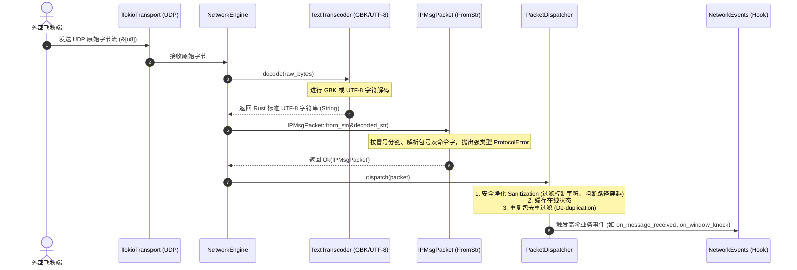
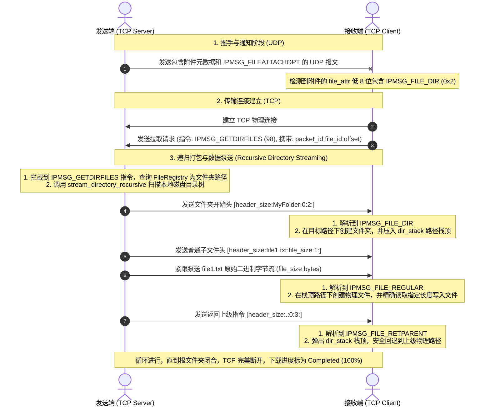

# Feiq Protocol Modern Reconstruction Architecture (飞秋协议现代化重建架构说明)

本文件详述了飞秋（IPMsg）协议现代化 Rust 重构版本的核心架构设计、核心流程、模组化扩展设计以及未来对接 GUI/CLI 界面与数据库持久化层的集成蓝图。

---

## 🗺️ 1. 架构核心原则 (Core Architectural Principles)

重构的核心目标是消除旧版代码中的高耦合、发散式修改、以及对特定本地化字符集（GBK）的强绑定。为此，我们建立了以下四个设计底线：

1. **协议层单一职责 (Single Responsibility Principle - SRP)**：
   * 协议层（`src/protocol`）**不触碰任何原始字节（Raw Bytes）**。它是一个纯粹的 CPU 密集型无状态转换器，仅处理 Rust 标准的 UTF-8 `String` 与结构体 `IPMsgPacket` 之间的序列化与反序列化。
2. **转码边界（TextTranscoder）插件化**：
   * 字符集编解码（GBK 与 UTF-8 互转）是一项传输层边界行为，其具体实现作为插件特征（Trait）被注入到网络引擎中。协议解析器不感知底层究竟是 GBK、Shift-JIS 还是 UTF-8。
3. **数据面与业务面完全解耦**：
   * 网络层（`src/network`）和协议层对外部的数据库存储、用户界面（GUI/CLI）**零感知**。
   * 网络层通过唯一的 `NetworkEvents` 事件通道（行为 Hook）向上抛出结构化高阶事件，所有具体的业务逻辑（写数据库、渲染 UI）均作为该事件通道的外部订阅者存在。
4. **零成本抽象 (Zero-Cost Abstractions)**：
   * 所有针对复合命令字 `cmd` 的位操作均通过 `#[inline]` 封装为 `IPMsgPacket` 的 Helper 方法（例如 `.is_file_attach()`）。它在编译后直接退化为原生机器位运算指令，兼具高级语言的极佳可读性与 C 语言级别的极速效率。

---

## 🧱 2. 系统核心模块结构 (Core Module Layout)

重构后的底层架构模块、特征（Trait）和数据流依赖关系如下面 Mermaid 关系图所示：

```mermaid
graph TD
    subgraph App_Layer [App Layer]
        GUI[Future GUI views / Controllers]
        DB[Database persister]
        Auto[Auto-responders / Bots]
    end

    subgraph Network_Layer [Network Layer & Engine]
        NE[NetworkEngine - Coordination & State]
        PD[PacketDispatcher - Validation & De-duplication]
        TT_Impl[TokioTransport - Physical UDP/TCP IO]
    end

    subgraph Core_Abstractions [Core Abstractions & Interfaces]
        TT_Trait[NetworkTransport Trait]
        TT_Fake[FakeTransport - Mock IO]
        TX_Trait[TextTranscoder Trait]
        TX_GBK[GbkTranscoder - Legacy compatibility]
        TX_UTF[Utf8Transcoder - High-speed tests]
        EV_Trait[NetworkEvents Trait]
        PK_Struct[IPMsgPacket Struct - Parser & Bitwise Helpers]
    end

    App_Layer -->|Registers / Subscribes| EV_Trait
    NE -->|Uses to Decode| TX_Trait
    NE -->|Uses to Parse| PK_Struct
    NE -->|Raises Events| EV_Trait
    NE -->|Delegates IO| TT_Trait
    PD -->|Filters Untrusted Data| PK_Struct

    TT_Trait <|-- TT_Fake
    TT_Trait <|-- TT_Impl
    TX_Trait <|-- TX_GBK
    TX_Trait <|-- TX_UTF
```

### 📁 模块说明：
* **`src/types.rs`**：定义飞秋领域的通用数据结构，包括文件附件模型 `FileAttachment`、传输状态 `TransferStatus`、无阻碍的协程控制器 `CancellationToken` 以及通用文件大小格式化辅助工具 `format_file_size`。
* **`src/error.rs`**：精细划分的错误边界，包括系统应用错误 `AppError`、底层网络传输错误 `NetworkError` 以及由于协议包格式非法引起的 `ProtocolError`（包含精确的结构性和字段型错误定位）。
* **`src/protocol/`**：
  * `command.rs`：纯粹的飞秋底层二进制协议常量字（指令字与标志选项），新增了文件夹相关的 `IPMSG_GETDIRFILES`、`IPMSG_FILE_REGULAR`、`IPMSG_FILE_DIR` 和 `IPMSG_FILE_RETPARENT`。
  * `codec.rs`：`IPMsgPacket` 协议包模型及针对多附件元数据编解码的 `serialize_file_attachments`/`parse_file_attachments` 纯字符转换函数。
  * `transcoder.rs`：声明 `TextTranscoder` 抽象，隔离字符集编码。
* **`src/network/`**：
  * `transport.rs`：抽象的网络收发接口，支持网络模拟与 Fake 注入测试。
  * `tokio_transport.rs`：高性能的、支持 UDP 端口忙时Fallback自适应搜寻、TCP 异步单文件、以及多级文件夹递归流式泵送/解析的 Tokio 物理实现。
  * `engine.rs`：核心协调中心，管理重传 ACKs (`AckTracker`)、共享文件索引 (`FileRegistry`) 和动态对端端口表 (`PeerDirectory`)。
  * `packet_dispatcher.rs`：高防卫性的包解包分发边界。在解析前执行严谨的用户及报文净化 (`Sanitization`)，防止乱码和安全漏洞。

---

## 🔄 3. 核心协议通信流程图 (Core Protocol Flowcharts)

### 📨 3.1 UDP 报文接收、解码与事件分发流程

当 Socket 收到 UDP 二进制包时的整个处理链路：



### 💾 3.2 截图与任意多级文件夹 TCP 泵送流程

飞秋对普通文件以及多级文件夹（通过 `IPMSG_GETDIRFILES` 协议）的高效异步并发传输控制：



---

## 🚀 4. 未来对接集成方案 (Future Integration Blueprint)

得益于这次干净的重构，未来在接入真实的图形用户界面（GUI）或数据库时，不需要改动核心协议层与网络层一行代码。以下是标准的高内聚集成指南：

### 💾 4.1 数据库持久化对接方案 (Database Integration)

在应用编排层中，数据库应该是一个纯粹的**事件监听者**。

```rust
// 这是一个位于未来的应用层持久化桥接器
pub struct DatabaseEventBridge {
    db_client: DbClient, // 具体的数据库客户端（如 SQLite / PG）
}

impl NetworkEvents for DatabaseEventBridge {
    fn on_message_received(
        &self,
        sender_ip: String,
        text_content: String,
        timestamp: i64,
        username: String,
    ) {
        // 在这里直接执行异步入库操作
        let db = self.db_client.clone();
        tokio::spawn(async move {
            if let Err(e) = db.save_message_to_history(sender_ip, text_content, timestamp, username).await {
                eprintln!("Warning: Failed to persist message: {}", e);
            }
        });
    }

    fn on_peer_status_changed(&self, ip: String, username: String, hostname: String, nickname: Option<String>, online: bool) {
        // 更新本地已知对端的用户缓存表
        let db = self.db_client.clone();
        tokio::spawn(async move {
            let _ = db.upsert_peer_info(ip, username, hostname, nickname, online).await;
        });
    }

    // ... 实现其他事件的回调 ...
}
```

* **挂载方式**：
  在初始化 `NetworkEngine` 时，直接将 `Arc<DatabaseEventBridge>` 作为 `event_dispatcher` 参数传入。
* **高吞吐保障**：由于事件回调中全部使用 `tokio::spawn` 投递至线程池执行磁盘持久化，数据库的任何读写延迟或死锁**物理上完全不会阻塞网络引擎的 UDP/TCP 消息吞吐**。

### 🖥️ 4.2 现代化 GUI 渲染集成方案 (GUI/UX Integration)

飞秋在运行图形界面时，通常需要处理大量的多线程状态渲染（例如聊天历史、好友列表、上传/下载百分比进度条）。

在 Rust 中，多线程 GUI（如 `Slint` 或 `egui`）与异步底层的对接最佳实践是使用**单生产者多消费者通道（mpsc）**或**状态机单向流**：

```rust
// 1. 定义发送给 GUI 线程的主事件枚举
pub enum GuiAppEvent {
    PeerUpdate { ip: String, online: bool, username: String },
    MessageReceived { ip: String, content: String },
    ProgressUpdate { task_id: i64, progress: f64 },
}

// 2. 实现一个 UI 桥接监听器
pub struct GuiEventBridge {
    gui_tx: tokio::sync::mpsc::UnboundedSender<GuiAppEvent>,
}

impl NetworkEvents for GuiEventBridge {
    fn on_message_received(&self, sender_ip: String, text_content: String, _timestamp: i64, _username: String) {
        let _ = self.gui_tx.send(GuiAppEvent::MessageReceived {
            ip: sender_ip,
            content: text_content,
        });
    }

    fn on_transfer_progress(&self, task_id: i64, progress: f64, _status: TransferStatus) {
        let _ = self.gui_tx.send(GuiAppEvent::ProgressUpdate {
            task_id,
            progress,
        });
    }

    // ...
}
```

* **GUI 主循环中的消费机制**：
  在图形渲染线程的主控制循环中（例如 `slint::invoke_from_event_loop` 或 `egui` 的事件轮询中），开启一个监听：
  ```rust
  // 在 GUI 启动时循环消费来自桥接器的事件
  let mut rx = gui_rx;
  tokio::spawn(async move {
      while let Some(event) = rx.recv().await {
          match event {
              GuiAppEvent::PeerUpdate { ip, online, username } => {
                  // 通过图形引擎线程安全方法，直接刷新好友列表数据模型 (Model)
              }
              GuiAppEvent::MessageReceived { ip, content } => {
                  // 在对应 IP 的聊天视图面板 (View) 追加一行气泡渲染
              }
              GuiAppEvent::ProgressUpdate { task_id, progress } => {
                  // 更新指定下载进度条的百分比
              }
          }
      }
  });
  ```
* **绝对线程安全与刷新流畅度**：这种基于 Channel 传递高阶 DTO 的设计，让底层异步网络引擎和主界面 UI 运行在各自独立的物理线程上，在获得极致 UI 刷新流畅度（60fps+）的同时，彻底规避了 Rust 界面编程中常见的生命周期和借用检查冲突。

---

## 🛡️ 5. 验证与高可靠保障机制 (Testing & Reliability)

基于全新解耦的架构，我们具备了比旧版强数倍的自动化防线：

1. **零 Socket 虚拟单元测试**：
   在测试 `packet_dispatcher` 或 `NetworkEngine` 逻辑时，注入 `FakeTransport` 代替真实的物理 Socket。我们可以在不占用任何端口、不发起真实网络传输的环境下，往 `FakeTransport` 中写入硬编码的 ASCII/GBK 字节，随后断言分发器捕获到的高阶业务事件是否正确。
2. **极速高并发环回传输验证**：
   `test_network_file_transfer_loopback` 和 `test_network_directory_transfer_loopback` 能够在几毫秒内同时拉起两个虚拟飞秋终端（Bob 和 Alice），进行真实的端口Fallback探测、UDP 握手传输、TCP 直接连接、大容量文件夹树深层递归打包与解析，这为核心网络状态机的稳定性提供了终极的可靠性屏障。
