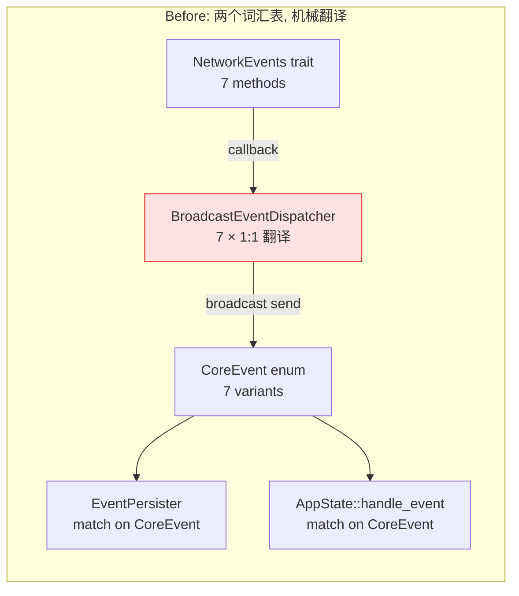
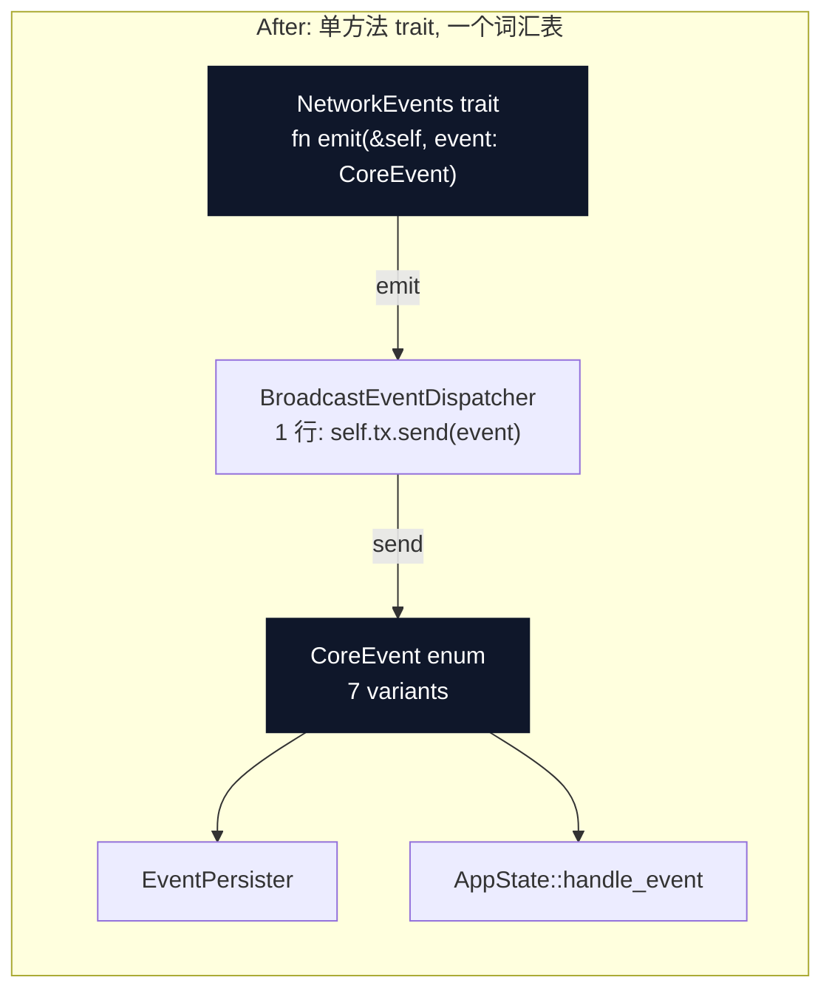
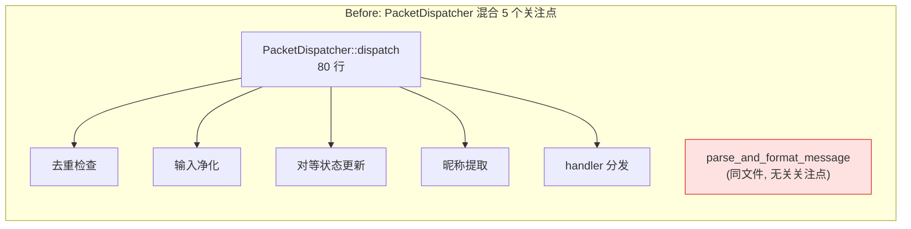
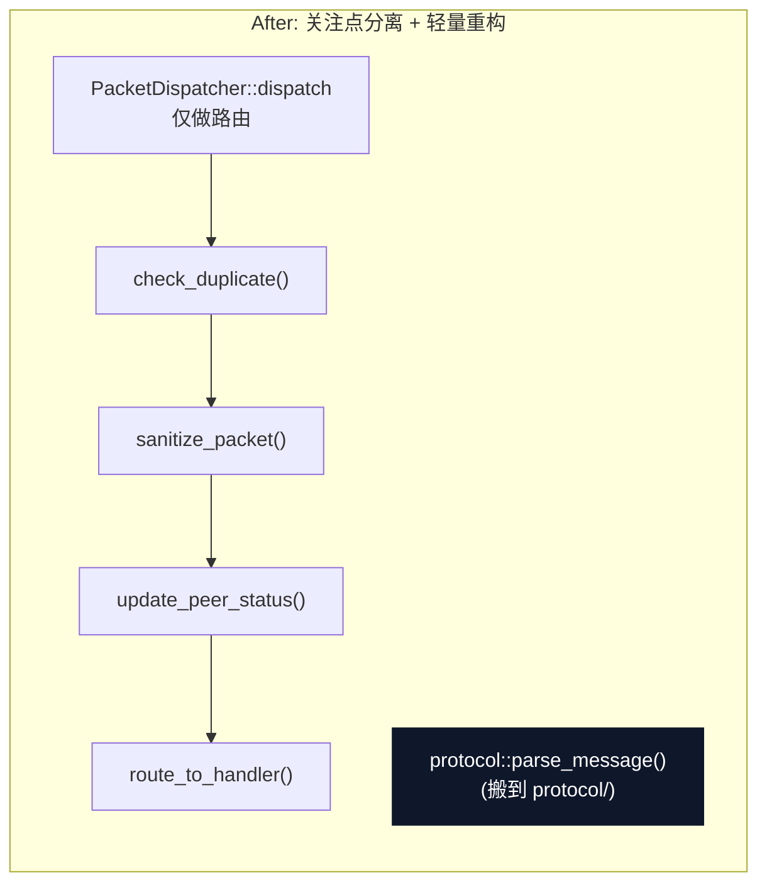

# Architecture Review — feiq-v2

> 2026-07-19 · 单 commit 代码库 · Pure Rust IPMessenger (飞秋/飞鸽传书 v1.2)
>
> 组合报告：自动审查（HTML）+ 人工复核评估。

---

## 图例

```
┌──────────┐
│  module  │   实线框 = 模块
└──────────┘

- - - - - - -   虚线 = seam (接缝)

  ╲ │ ╱         红色箭头 = leakage (泄漏)
   ╲│╱

┌██████████┐
█ deep mod █   厚黑框 = deep module (深模块)
└██████████┘
```

---

## 项目结构速览

```
src/
  lib.rs              # 库入口, 5 个 pub mod
  types.rs            # CoreCommand(8 变体), CoreEvent(7 变体), FileAttachment, CancellationToken
  error.rs            # AppError → NetworkError | DatabaseError | Protocol | Io | Other
  engine/
    mod.rs            # EngineHandle (启动/生命周期), start_engine()
    actor.rs          # CoreEngineActor (消息循环 120 行) + BroadcastEventDispatcher (7 × 1:1 翻译)
    event_persister.rs# EventPersister (CoreEvent → DB 持久化, 5 个 match 分支 + 单元测试)
    handlers/         # 8 个 CommandHandler 实现 — 每文件一个零状态 unit struct
      mod.rs          # CommandHandler trait + HandlerContext(6 字段依赖袋) + re-export 8 个 handler
      send_message.rs # 25 行: resolve port → send UDP(IPMSG_SENDMSG) → save MessageRecord
      send_knock.rs   # 28 行: resolve port → send UDP(IPMSG_KNOCK) → save MessageRecord (同上!)
      broadcast_presence.rs # 9 行
      update_identity.rs    # 18 行
      download_file.rs      # 36 行
      share_file.rs         # 46 行
      register_shared_file.rs # 19 行
      scan_subnet.rs        # 13 行
  network/
    mod.rs            # NetworkEngineTrait(10 方法), NetworkEvents trait(7 回调), PacketHandler trait
    engine.rs         # NetworkEngine: UDP/TCP/对等发现/包分发/统计, ~300 行
    transport.rs      # NetworkTransport trait (5 方法)
    tokio_transport.rs# TokioTransport — 真实 UDP socket + TCP listener + 文件传输
    fake_transport.rs # FakeTransport — 测试用, 捕获发出包 + 注入进入包
    packet_dispatcher.rs # PacketDispatcher: 去重 + 净化 + 对等发现 + 6 个 handler 注册
    ack_tracker.rs    # AckTracker: 发送-等待-ACK 重试, 超时 2s
    file_registry.rs  # FileRegistry: 共享文件注册/查找 (多 key 格式)
    peer_directory.rs # PeerDirectory: IP→port 映射, 默认 2425
    validation.rs     # 输入净化: 用户名(64 字符截断), 消息体(去控制字符), 文件名(去路径分隔符)
  protocol/
    codec.rs          # IPMsgPacket GBK 编解码 + 文件附件序列化/解析
    command.rs        # IPMsg 协议常量 (IPMSG_SENDMSG=0x20, IPMSG_KNOCK=0xD1, ...)
  database/
    mod.rs            # DatabaseManager(17 ops) + DbActor + DbClient + db_commands! 宏
  bin/
    cli/              # CLI: args.rs + term.rs + main.rs (stdin 命令循环)
    gui/              # GUI: egui/eframe, app.rs + app_state.rs + views/{left_nav,middle_list,chat_view,settings}
```

---

## 候选 1：合并两个事件词汇表

| 项目 | 内容 |
|------|------|
| **原报告评级** | Strong |
| **我的评级** | 方向对，力度偏激进 |
| **涉及文件** | `network/mod.rs` `types.rs` `engine/actor.rs` `engine/event_persister.rs` `bin/gui/app_state.rs` |

### Before / After





### 问题

`NetworkEvents` trait（7 个命名回调方法）与 `CoreEvent` enum（7 个变体）在结构上 1:1 同构。`BroadcastEventDispatcher` 对每个方法做纯机械翻译——收到回调就 `self.event_tx.send(CoreEvent::Variant{...})`。添加一个新事件需要触碰 5 处文件。

### 分析

- **Seam 本身是合理的。** `NetworkEvents` trait 确实有两个适配器（生产：`BroadcastEventDispatcher` → broadcast channel；测试：`MockEvents` / `TestEvents` 空实现）。规则是"一个适配器 = 假设性 seam，两个 = 真实 seam"——这个 seam 是挣到了的。
- **问题不在 seam，在重复词汇。** Network 层定义了一套事件名（`on_message_received`），engine 层又定义了一套（`CoreEvent::MessageReceived`），两者是同一样东西的不同命名。`BroadcastEventDispatcher` 之所以显浅，不是因为它不该存在，而是因为两边的词汇表一模一样，它只是把左手的词翻译成右手的同一个词。

### 建议方案

**压缩 `NetworkEvents` trait 为单方法：**

```rust
pub trait NetworkEvents: Send + Sync + 'static {
    fn emit(&self, event: CoreEvent);
}
```

- network 层不再为每种事件维护命名回调，只知道"发出一个事件"
- `BroadcastEventDispatcher` 的实现变成一行 `self.event_tx.send(event)`
- 添加新事件只需碰 3 处（`CoreEvent` 变体 + emit 调用点 + `EventPersister` / GUI 消费端）
- seam 保留（测试端仍然可以用空实现 `fn emit(&self, _: CoreEvent) {}`）

> **更轻的替代：** 对于这个规模的单开发者项目，用 `Arc<dyn Fn(CoreEvent) + Send + Sync>` 替代 trait 也可以。效果一样，少一个 trait 定义和一个 struct。

### Wins

- 删除 ~50 行机械翻译代码（7 个 impl 方法）
- locality：添加新事件 = 1 个 enum 变体 + 1 个 emit 点 + 消费端
- interface 压缩：trait 从 7 方法 → 1 方法
- seam 不丢：测试注入保持不变

---

## 候选 2：折叠 handler 分发链

| 项目 | 内容 |
|------|------|
| **原报告评级** | Strong |
| **我的评级** | **Strong — 最强的候选，第一个做** |
| **涉及文件** | `engine/actor.rs` `engine/handlers/mod.rs` `engine/handlers/*.rs` (8 文件) `tests/handler_tests.rs` |

### Before / After — 交叉剖面

```
Before: 8 个浅 handler 模块（每一层都是薄透传）       After: 1 个深模块
═══════════════════════════════════════════════   ═══════════════════════════════
  SendMessageHandler   — 25 行                       ┌█████████████████████████┐
  SendKnockHandler     — 28 行  ← 与上几乎相同       █ CoreEngineActor::run   █
  BroadcastPresence    —  9 行                       █                        █
  UpdateIdentity       — 18 行                       █ match cmd {            █
  DownloadFile         — 36 行                       █   SendMessage => {..}  █
  ShareFile            — 46 行                       █   SendKnock => {..}    █
  RegisterSharedFile   — 19 行                       █   BroadcastPresence..  █
  ScanSubnet           — 13 行                       █   UpdateIdentity..     █
                                                     █   DownloadFile => {..} █
  每个: 1 文件 + 1 unit struct                       █   ShareFile => {..}    █
       + 1 trait impl + 1 if-let                      █   RegisterSharedFile.. █
                                                     █   ScanSubnet => {..}   █
  HandlerContext (6 字段依赖袋)                       █ }                      █
  CommandHandler trait (1 方法)                       █                        █
  handlers/mod.rs (re-export 8 个)                    █ ~150 行, 1 个文件      █
                                                     └█████████████████████████┘
```

### 问题

当前命令处理经过**三层分发**：

```
CoreEngineActor::run                    ← 第 1 次 match
  match &cmd {
    CoreCommand::SendMessage => SendMessageHandler.handle(cmd, &ctx)
    ...
  }
    → SendMessageHandler::handle        ← 第 2 次 match (if let)
        if let CoreCommand::SendMessage {..} = cmd { ... }
```

8 个 handler 文件都是零状态 unit struct。`CommandHandler` trait 和 `HandlerContext`（6 字段）只是为了支撑这些 handler 存在而存在的。

**删除测试：** 删掉 `SendMessageHandler`，它的 25 行逻辑直接写回 `CoreEngineActor::run` 的 match 分支里——复杂度没有被集中或消除，只是搬了位置。证明 handler 文件是纯透传模块（shallow pass-through），不挣自己的位置。

### 建议方案

将 8 个 handler 的 body 直接 inline 到 `CoreEngineActor::run` 的 match 分支中。`CoreEngineActor` 已经持有所有依赖（`network`, `db`, `event_tx`, `cmd_tx`, `dispatcher`, `cancel`）——handler 没引入任何 actor 没有的东西。

**删除清单：**

| 删除项 | 行数 |
|--------|------|
| `engine/handlers/send_message.rs` | ~25 |
| `engine/handlers/send_knock.rs` | ~28 |
| `engine/handlers/broadcast_presence.rs` | ~9 |
| `engine/handlers/update_identity.rs` | ~18 |
| `engine/handlers/download_file.rs` | ~36 |
| `engine/handlers/share_file.rs` | ~46 |
| `engine/handlers/register_shared_file.rs` | ~19 |
| `engine/handlers/scan_subnet.rs` | ~13 |
| `engine/handlers/mod.rs` (trait + context + re-exports) | ~40 |
| `CommandHandler` trait | — |
| `HandlerContext` struct | — |

**新增：** `CoreEngineActor::run` 从 ~50 行 match 骨架扩展到 ~150 行完整实现。

**测试迁移：** `tests/handler_tests.rs` 使用 `MockNetworkEngine` 测 handler，改为测 actor 的对应命令即可——mock 照用。

### Wins

- locality：所有命令处理逻辑在一个 150 行方法里，不用在 8 个文件间跳转
- interface 消失：`CommandHandler` trait + `HandlerContext` 不复存在
- leverage：添加新命令 = 加一个 `CoreCommand` 变体 + 加一个 match 分支（目前是：1 变体 + 1 handler 文件 + 1 trait impl + 1 re-export + 1 match 映射）
- 测试面不变：actor 的 match 分支跟 handler 的 `handle()` 用同一个 mock 测

---

## 候选 3：SendMessage 与 SendKnock 去重

| 项目 | 内容 |
|------|------|
| **原报告评级** | Worth exploring |
| **我的评级** | C2 的自然附带清理，不单独立项 |
| **涉及文件** | `engine/handlers/send_message.rs` `engine/handlers/send_knock.rs` |

### 共享结构（Mass Diagram）

```
SendMessage                             SendKnock
┌──────────────────────┐               ┌──────────────────────┐
│ get_peer_port()      │  ← 相同 ←     │ get_peer_port()      │
│ send_packet(         │               │ send_packet(         │
│   IPMSG_SENDMSG)     │  ← 不同 ←     │   IPMSG_KNOCK)       │
│ save_message(db)     │  ← 相同 ←     │ save_message(db)     │
│ error handling       │  ← 相同 ←     │ error handling       │
└──────────────────────┘               └──────────────────────┘
      25 行                                  28 行
```

两个 handler 共享相同的处理模式：

```
resolve peer port → send UDP packet with cmd flag → save MessageRecord → error handling
```

唯一差异：命令常量（`IPMSG_SENDMSG` vs `IPMSG_KNOCK`）和消息内容。

### 分析

这段重复约 25 行。如果 C2 已执行，两个 match 分支会在 `CoreEngineActor::run` 中相邻出现。提取一个 `send_and_log(to_ip, cmd_flag, content)` 辅助函数只需 3 分钟。

**作为 C2 的一部分一起做，不需要单独规划。**

---

## 候选 4：PacketDispatcher 关注点分离

| 项目 | 内容 |
|------|------|
| **原报告评级** | Worth exploring |
| **我的评级** | 问题真实，方案可更轻量 |
| **涉及文件** | `network/packet_dispatcher.rs` `protocol/codec.rs` `network/validation.rs` |

### Before / After





### 问题

`PacketDispatcher::dispatch` 在 80 行里做了 5 件不同的事：去重、净化、对等发现更新、昵称提取、handler 路由。同一文件中还有 `parse_and_format_message` 自由函数，处理完全不同的事情——消息正文解析、附件提取、字体样式剥离、剪贴板自动下载。后者是协议层关注点，却寄生在网络层的分发器里。

### 分析

- 80 行的编排方法在 Rust 里不算异常——5 个步骤是顺序的、清晰的
- 拆成几个 private 方法即可显著提升可读性
- `parse_and_format_message` 移到 `protocol/codec.rs`（当前 160 行）旁边即可——不需要新建子模块
- 原报告建议新建 `protocol/message_parser` 模块——对于 40 行的 free function 仪式感偏重

### 建议方案

- `PacketDispatcher`：提取 `check_duplicate()`、`sanitize_packet()`、`update_peer_status()`、`route_to_handler()` 四个 private 方法，不改外部接口
- `parse_and_format_message` → 移入 `protocol/mod.rs` 或 `protocol/codec.rs`，作为 `pub fn parse_message()`
- 不新建模块，不引入新 trait/struct

---

## 候选 5：拆分 DatabaseManager

| 项目 | 内容 |
|------|------|
| **原报告评级** | Speculative |
| **我的评级** | **✗ 不建议做** |
| **涉及文件** | `database/mod.rs` |

### 当前结构

```
DatabaseManager (17 个操作方法, 1 个 Connection)
┌─────────────────────────────────────────────┐
│  PeerStore 相关     save_peer, get_peers     │
│  MessageStore 相关  save_message, get_chat_history, count
│  FileTaskStore 相关 create, update_progress, get_status, count, max_id
│  ConfigStore 相关   save_config, get_config
│  SubnetStore 相关   save_subnets, get_subnets
│  SessionStore 相关  save, get, delete active sessions
└─────────────────────────────────────────────┘
              ↓ db_commands! 宏生成 actor 模式
         DbClient (17 个 async 方法) → DbActor (1 个 run loop)
```

### 分析

- 17 个操作对于单个 SQLite 应用是**正常规模**。`DatabaseManager` 就是 "SQLite 前面的一层薄壳"——interface 宽度等于"应用需要哪些查询"，这是合理的。
- `db_commands!` 是这个模块里最有意思的设计——用声明式宏集中管理所有 DB 命令的 actor 样板。拆成 4 个 store 意味着要么写 4 遍类似的宏，要么换一种完全不同的抽象。
- `DatabaseManager::new(":memory:")` 已经做到了零依赖隔离测试。拆成 4 个 store 不会让测试更简单。
- 拆分带来的 leverage 有限：`EventPersister` 需要 3 种操作，用当前 `DbClient` 传进去跟用 3 个 store 传进去——调用方代码量基本不变。

### 不做

当前的单体 `DatabaseManager` 在这个规模上是合适的设计。它是一个深模块：interface 就是"应用需要的所有持久化操作"，implementation 是 rusqlite + 迁移 + WAL 配置。interface 宽是因为应用需求宽，不是设计缺陷。

---

## 执行优先级

```
优先级 1 ──→ 候选 2    折叠 handler 分发链
              删除 8 个 handler 文件 + CommandHandler trait + HandlerContext
              150 行 actor match, 1 个文件
              
优先级 2 ──→ 候选 3    (作为 C2 的附带清理)
              提取 send_and_log() 辅助函数

优先级 3 ──→ 候选 1    压缩 NetworkEvents trait
              7 方法 → 1 方法 (或 Arc<dyn Fn>)

优先级 4 ──→ 候选 4    PacketDispatcher 轻量重构
              提取 private 方法 + 搬 parse_and_format_message

   不做 ──→ 候选 5     DatabaseManager 保持单体
```

### 为什么不先做 C1

C1 改动的是 network ↔ engine 之间的 seam——系统最核心的接缝。C2 改动的是 engine 内部组织——影响面更小、风险更低。先做 C2（低风险、高回报），再做 C1（中等风险、中等回报），顺序更稳。且 C2 完成后，actor 里的 match 分支直接发 `CoreEvent`，C1 的改动会更直观。

### 通用原则

- 不引入新 trait 替代现有的（除非压缩现有 trait）
- 不新建超过 1 个模块（已经够多了）
- 不改变公开 API：`CoreCommand`、`CoreEvent`、`EngineHandle` 接口保持稳定
- 不拆分 `DatabaseManager`
